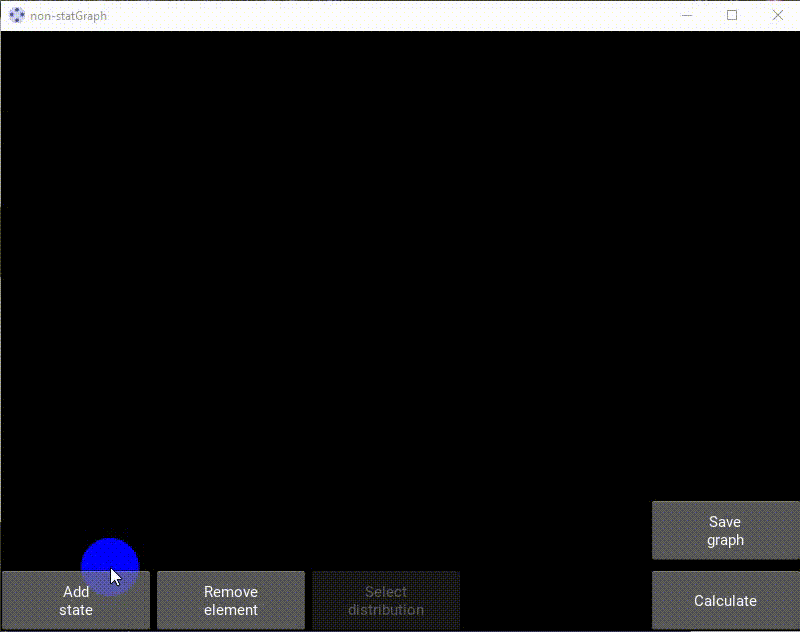
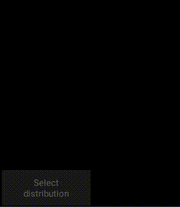
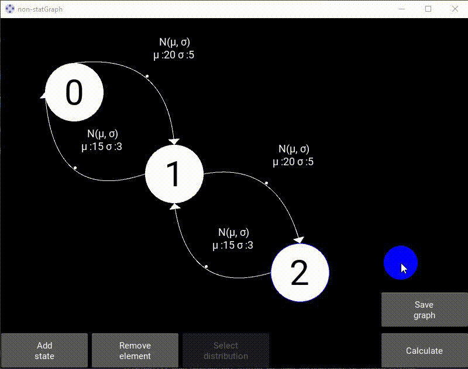

<h1 align="center">non-statGraph</h1>

## Description  

---

### Theory :mortar_board:

 The app calculates the probability of being in a certain state of a queuing system with arbitrary distributions of time points between incoming requests and their service time points. The app is based on the use of the Laplace transform and the principle of probabilistic balance when compiling equations for images of the probabilities of the system states. The application allows you to explore the transient process in systems that are called non-stationary. 

---

### Features :fire:
#### Draw
Draw system state graph

#### Сhoose 
Сhoose the laws of distribution of transitions between system states: Exponential, Gamma, Normal, Uniform and Rayleigh.

#### Solution
Get the results of solving state probabilities process in the form of curves from time.

#### Restriction
If you use different distribution laws for one system, then make sure you have a **powerful** computer)

---

### Settings :gear:

App settings are set in a file setting.py.

* **DEBUG**: bool - mode of operation, if *True*, outputs intermediate results of calculations to the console (default *True*);  

#### Color
  
The app uses the RGB color palette.  
  
* **COLOR_SELECTED**: list - color of selected objects (default *yellow [1, 1, 0]*);  
* **COLOR_CONDITION**: list - color of process state (default *white [1, 1, 1]*);   
* **COLOR_TEXT_CONDITION**: color of number of process state (default *black [0, 0, 0]*);  
* **COLOR_COUNTER_CONDITION**: list - color of outer contour of process state (default *blue [0, 0, 1]*);  
* **COLOR_CONNECTOR**: list - color of process state connectors (default *red [1, 1, 1]*);  
* **COLOR_BGR**: list - app background color, color palette **RGBA** (default *black [0, 0, 0, 0]*);  
* **COLOR_BEZIE_LINE**: list - color of lines connecting process states (default *white [1, 1, 1]*);   
* **COLOR_TEXT**: list - color of text other elements (default *white [1, 1, 1]*);  
  
#### Size
  
The app uses pixels as the unit of measurement.   
  
* **WIDTH_LIGHTER**: int - width of highlighter line of process state (default *3*);  
* **WIDTH_COUNTER**: int - width of outer contour of process state (default *1*);  
* **SIZE_ARROW**: int - size of arrow of lines connecting process states (default *10*);  
* **SIZE_BTN**: tuple - size of all button app, length*height, (default *(150, 60)*);
* **RADIUS_CONDITION**: int - radius of process state (default *50*);  
* **RADIUS_CONNECTOR**: int - radius of process state connectors  (default *5*);  
* **RADIUS_BEZIER_POINT**: int - radius of point of lines connecting process states (default *5*);   

#### Fonts

* **FONT_SIZE_LABEL_CONDITION**: int - fontsize of number process state (default *60*);  
* **FONT_SIZE_LAW_PARAM**: int - fontsize of text distribution law (default *18*);  
* **FONT_SIZE_MESSAGE_TO_USER**: int - fontsize of text message to user (default *14*);  

--- 

### Requirements :link:

Installing packages: **pip install -r requirements.txt**  

General:  
* Kivy  
* Sympy  
* Scipy
* Matplotlib  

---

TAGS :label:: laplace, state of system, distribution laws, graphs, Dirac, delta function
