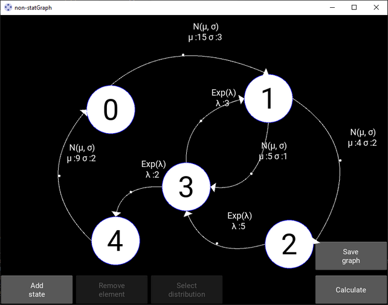

<h1 align="center">non-statGraph</h1>

## Description

###Settings  

App settings are set in a file *setting.py*. The app uses the RGB color palette. 

* **DEBUG**: bool - mode of operation, if *True*, outputs intermediate results of calculations to the console (default *True*);  
* **COLOR_SELECTED**: list - color of selected objects (default *yellow [1, 1, 0]*);  
* **COLOR_CONDITION**: list - color of process state (default *white [1, 1, 1]*);   
* **COLOR_TEXT_CONDITION**: color of number of process state (default *black [0, 0, 0]*);  
COLOR_TEXT: list = [1, 1, 1]
COLOR_CONNECTOR: list = [1, 0, 0]
COLOR_BGR: list = [0, 0, 0, 0]
COLOR_BEZIE_LINE: list = [1, 1, 1]
COLOR_COUNTER_CONDITION: list = [0, 0, 1]

SIMPLE_CONNECT: bool = True

WIDTH_LIGHTER: int = 3
WIDTH_COUNTER: int = 1
FONT_SIZE_LABEL_CONDITION: int = 60
FONT_SIZE_LAW_PARAM: int = 18
FONT_SIZE_LABEL_BEZIE: int = 18
FONT_SIZE_MESSAGE_TO_USER: int = 14

SIZE_ARROW: int = 10
SIZE_BTN: tuple = (150, 60)
PADDING_VERTICAL: int = 30
PADDING_HORIZONTAL: int = 10

RADIUS_CONDITION: int = 50
RADIUS_CONNECTOR: int = 5
RADIUS_BEZIER_POINT: int = 5

LAW_SYMBOLS: dict = {'expon': 'Exp(\u03BB)',
                     'gamma': '\u0393(\u03BA, \u03B8)',
                     'norm': 'N(\u03BC, \u03C3)',
                     'uniform': 'U(a)',
                     'rayleigh': 'Rayl(\u03C3)'}

LAW_FULL_NAME: dict = {'expon': 'Экспоненциальное\nраспределение',
                       'gamma': 'Гамма\nраспределение',
                       'norm': 'Нормальное\nраспределение',
                       'uniform': 'Равномерное\nраспределение',
                       'rayleigh': 'Распределение\nРэлея'}

LAW_PARAM: dict = {'expon': ['\u03BB :'],
                   'gamma': ['\u03BA :', '\u03BB :'],
                   'norm': ['\u03BC :', '\u03C3 :'],
                   'uniform': ['a :'],
                   'rayleigh': ['\u03C3 :']}